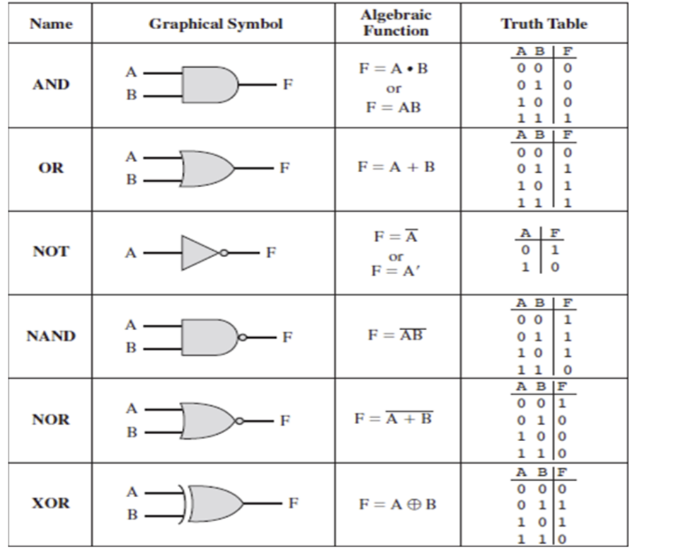

# Computacion_Cuantica

## Disclaimer

**Primer proyecto para introducir el tema. Si alguna definición o información es errónea, es porque es el primero.**

## Índice

1. [Historia](#historia)
2. [Computación Clásica](#computación-clásica)
3. [Computación Cuántica](#computación-cuántica)
4. [Computación Clásica VS Computación Cuántica](#computación-clásica-vs-computación-cuántica)
5. [Álgebra lineal en relación con la Cuántica](#álgebra-lineal-en-relación-con-la-cuántica)
6. [Criptografía en relación al RSA](#criptografía-en-relación-al-rsa)

## Historia

Para entender qué es la computación cuántica hay primero que entender de dónde viene y qué es lo que estaba pasando en ese momento. 

- **Siglos XVII-XIX:** aparecen las primeras calculadoras mecánicas y se desarollan conceptualmente las máquinas programables.
- **1930-1940:** Alang Turing desarrolla un modelo teórico de computación que establece las bases de la informática moderna.
- **1940-1960:** Se construyen los primeros ordenadores y se extiende el uso de los bits (`0` y `1`) para representar información.
- **1980-1990:** Se plantea la posibilidad de usar sistemas cuánticos para realizar cálculos.
- **1994:** Peter Shor presenta un algoritmo cuántico capaz de refactorizar números enteros grandes de forma más eficiente los métodos clásicos.
- **2000-2020:** Avanzan los procesadores cuánticos y los experimentos con qubits.
- **Actualidad:** se continúa desarrollando la computación cuántica para resolver problemas especializados.

## Computación Clásica

La que usan nuestros dispositivos electrónicos. La unidad básica de información que usan es el **bit** que tiene los valores de `0` y `1`.

Representan estados físicos del sistema electrónico que se interpretan como información digital. El ordenador procesa la información mediante circuitos lógicos.

## Computación Cuántica

La computación cuántica usa principios de la física cuántica para procesar información.

Su unidad básica es el **qbuit** (*quantum bit*).

El bit clásico se representa con `0` y `1`. En cambio, un qubit puede encontrarse en una combinación cuántica de ambos estados, *superposición*.

Los estados básicos se representan con:
- $|0\rangle$ : estado cuántico correspondiente a `0`.
- $|1\rangle$ : estado cuántico correspondiente a `1`.

Un qubit en superposición se puede escribir como:

$|\psi\rangle = \alpha|0\rangle+\beta|1\rangle$

* $|\psi\rangle$ : *estado genérico.* 
* $\alpha$ : *amplitud de probabilidad, puede ser un número complejo.*
* $\beta$ : *amplitud de probabilidad, pueden ser un número complejo.*

Para un estado [normalizado](docs/detalles.md) tiene que cumplir:

$|\alpha|^2+|\beta|^2=1$

Cuando medimos el qubit obtenemos `0` o `1`. Las amplitudes permiten calcular las probabilidades de obtener cada resultado.

*Una superposición no significa que podamos leer un 0 y un 1 a la vez. Al medir un qubit individual se obtiene un único resultado. Los qubits pueden presentar entrelazamiento que permite establecer relaciones entre sistemas.*

### 📊 Visualización de un qubit

La esfera de Bloch es una representación habitual de los estados de un qubit. Es una forma de visualizar conceptos que no tienen un equivalente directo en un bit clásico.

## Computación Clásica VS Computación Cuántica

| Característica | Computación clásica | Computación cuántica |
|---|---|---|
| Unidad básica | Bit | Qubit |
| Estados básicos | `0` o `1` | \(|0\rangle\) o \(|1\rangle\), además de superposiciones |
| Fundamento | Electrónica digital y física clásica a nivel lógico | Mecánica cuántica |
| Operaciones | Puertas lógicas clásicas | Puertas cuánticas |
| Representación matemática | Valores binarios y lógica booleana | Vectores, matrices y amplitudes complejas |
| Medición | Lectura del estado digital | Obtención de un resultado probabilístico |
| Errores | Se producen, pero existen técnicas de detección y corrección | La decoherencia y los errores cuánticos dificultan el cálculo |
| Aplicaciones | Sistemas operativos, videojuegos, bases de datos, redes y servidores | Investigación en química, materiales, optimización y criptografía |
| Madurez | Tecnología ampliamente desarrollada | Tecnología en desarrollo |

## Álgebra lineal en relación con la Cuántica

Para entender la computación cuántica se necesitan conecptos de álgebra lineal. El Álgebra lineal perminte operar con vectores, matrices y transformaciones que se usan en las puertas cuánticas para modificar los estados de un qubit.

### Bits --> Vectores

En Computación Clásica representamos un bit mediante uno de estos dos estados: `0` o `1`.

En Computación Cuántica se representan los estados básicos mediante vectores:

$
|0\rangle = \begin{pmatrix} 1 \\ 0 \end{pmatrix}
\qquad
|1\rangle = \begin{pmatrix} 0 \\ 1 \end{pmatrix}
$

### Amplitudes de probabilidad

Para obtener la probabilidad de un resultado, se calcula el módulo de su amplitud y lo elevamos al cuadrado.

Si tenemos un qubit en el estado:

$
|\psi\rangle = \frac{1}{\sqrt{2}}|0\rangle
+
\frac{1}{\sqrt{2}}|1\rangle
$

Las amplitudes son:

$
\alpha=\frac{1}{\sqrt{2}}
\qquad
\beta=\frac{1}{\sqrt{2}}
$

Y las probabilidades son:

$ P(0)=|\alpha|^2=\frac{1}{2} $

$ P(1)=|\beta|^2=\frac{1}{2} $

Al medir un qubit tenemos un 50% de probabilidad de obtener un `0` y un 50% de probabilidad de obtener un `1`.

Para que ambos resultados tengan la misma probabilidad, las dos amplitudes tienen el mismo módulo. La condición de normalización es:

$ |\alpha|^2+|\beta|^2=1 $

## Criptografía en relación al RSA

RSA es un algoritmo criptográfico para proteger la información. Se basa en la multiplicación de números primos muy altos que, al ser muy complicados de factorizar por los ordenadores, componen su seguridad.

La camputación cuántica a su vez, al estar basada en el álgebra lineal, no tiene esos problemas para sacar los factores que los componen. Por ello, se está migrando a mecanismos criptográficos diferentes que no tengan esa vulnerabilidad.

## 📖 Referencias

- [IBM Quantum Learning](https://learning.quantum.ibm.com/)
- [NIST: Post-Quantum Cryptography](https://csrc.nist.gov/projects/post-quantum-cryptography)
- [Wikipedia: Quantum computing](https://en.wikipedia.org/wiki/Quantum_computing)

**Este repositorio se va a utilizar en un ejercicio de la clase de Implantación de aplicaciones web de 2º de ASIR del instituto IES Clara del Rey.**

.jpg)